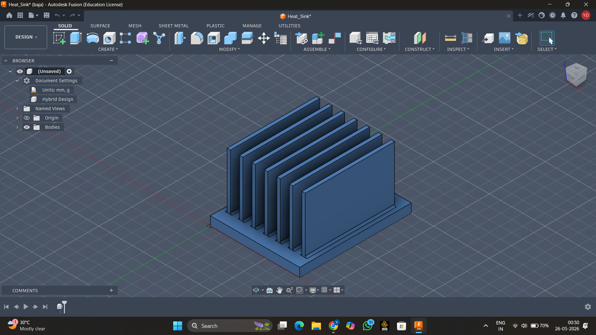
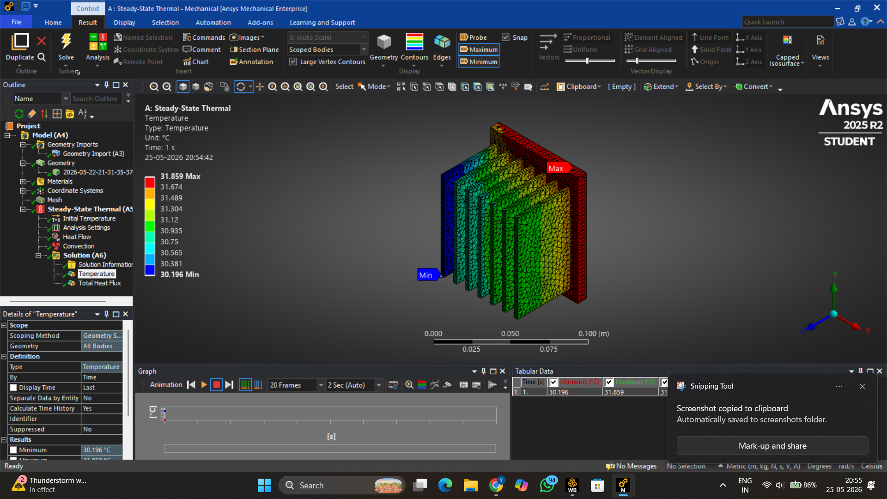
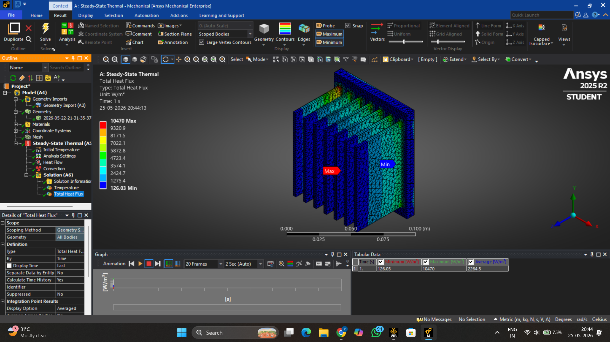

# Finned Heat Sink — CAD Design and Thermal FEA

A parametric finned heat sink designed in Autodesk Fusion 360 and analysed
using ANSYS Workbench (Steady-State Thermal) to study the effect of fin
geometry on heat dissipation under natural convection.

---

## Motivation

I was reading about Inverse Heat Transfer problems and kept coming across
concepts like heat flux distribution and fin efficiency. I decided to model
a heat sink and run a steady-state simulation to develop physical intuition
for how heat actually moves through a fin array.

---

## CAD Model — Fusion 360

| Parameter | Value |
|---|---|
| Base plate | 100 × 80 × 8 mm |
| Number of fins | 7 |
| Fin height | 50 mm |
| Fin thickness | 3 mm |
| Fin pitch | ~9.5 mm |
| Fillet at fin root | 1.5 mm |
| Material | Aluminium 6061 |

Fins were patterned using Rectangular Pattern. 1.5 mm root fillets were
added to reduce stress concentration at the base-fin junction and improve
heat conduction into the fins.

---

## Thermal FEA — ANSYS Workbench

| Setting | Value |
|---|---|
| Analysis type | Steady-State Thermal |
| Mesh element size | 2 mm |
| Heat input | 10 W (bottom face — simulating chip) |
| Convection coefficient | 25 W/m²·°C (natural air cooling) |
| Ambient temperature | 22°C |
| Convection applied on | 41 faces (all fin surfaces + exposed base) |

---

## Results

| Parameter | Value |
|---|---|
| Max temperature | 31.86°C (base plate) |
| Min temperature | 30.20°C (fin tips) |
| Max heat flux | 10,470 W/m² (fin roots) |
| Min heat flux | 126 W/m² (fin tips) |

The 1.66°C temperature difference across the heat sink reflects
Aluminium's high thermal conductivity (k ≈ 202 W/m·K) — heat spreads
rapidly and uniformly across the fin array. The heat flux contour confirms
the expected gradient: highest at fin roots (steepest dT/dx) and lowest
at fin tips.

**Temperature Contour:**

**Total Heat Flux Contour:**

---

## Observations

- Heat flux distribution validates Fourier's law — q = -k·dT/dx is
  highest where the temperature gradient is steepest (fin roots)
- The uniform temperature across the fin height indicates the fins are
  operating at high efficiency for this geometry and convection coefficient
- Increasing h (forced convection / fan cooling) would increase the
  temperature gradient and make the fin efficiency effect more visible

---

## Tools

Autodesk Fusion 360 · ANSYS Workbench 2025 R2

---

*NIT Karnataka — 3rd Year, Mechanical Engineering*
